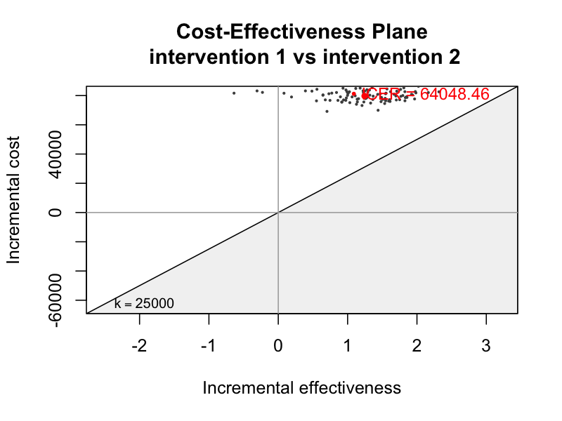

# omopHeor: Health Economics and Outcomes Research Pipeline on OMOP CDM

[](https://github.com/iomedhealth/omopHeor/actions/workflows/R-CMD-check.yaml)
[](https://iomedhealth.github.io/omopHeor/)
[](https://github.com/iomedhealth/omopHeor/releases)
[](https://opensource.org/licenses/MIT)

**omopHeor** is an R-based analytical ecosystem developed by [IOMED](https://www.iomed.health/) for Real-World Evidence (RWE) and Health Economics and Outcomes Research (HEOR). It streamlines the end-to-end process of Healthcare Resource Utilization (HCRU) analysis, direct medical costing, and Cost-Effectiveness Analysis (CEA) directly on observational healthcare data structured in the **OMOP Common Data Model (CDM)**.

## Key Features

- **OMOP CDM Native**: Connects directly to OMOP CDM databases via `CDMConnector` and `omopgenerics`.
- **Modular Monorepo Architecture**: Decouples lightweight HCRU extraction (`CohortUtilisation`), direct costing (`CohortCosts`), and HEOR modeling (`CohortEconomics`) under a unified metapackage (`omopHeor`).
- **3-Layer Care Utilization Suite**: Episode constructors, in-database column enrichers, and standardized GT / Flextable reporting.
- **Direct Medical Cost Extraction**: Polymorphic OMOP `COST` table linkage across visits, drugs, and procedures with automated zero-fill handling.
- **End-to-End Decision Science**: Propensity score adjustment (`Cyclops`), Markov state-transition models, and CEA visualizations (`BCEA`).
- **Instant Prototyping**: Includes `mockOmopHeor()` providing an in-memory synthetic DuckDB OMOP CDM database.

## Getting Started

### Prerequisites

- R (>= 4.1.0)
- `pak` package manager (`install.packages("pak")`)

### Installation

```R
# Install the complete omopHeor metapackage (recommended)
pak::pkg_install("iomedhealth/omopHeor")

# Or install individual standalone domain packages
pak::pkg_install("iomedhealth/omopHeor/packages/CohortUtilisation")
pak::pkg_install("iomedhealth/omopHeor/packages/CohortCosts")
pak::pkg_install("iomedhealth/omopHeor/packages/CohortEconomics")
```

### Quick Start 1: In-Database Cohort Utilization & Cost Enrichment

Enrich study cohorts in-database across configurable temporal windows (e.g., baseline `[-365, -1]`, follow-up `[0, 365]`, or full follow-up `[0, Inf]`) and produce publication tables:

```R
library(omopHeor)
library(dplyr)

# 0. Connect to CDM (built-in synthetic mock database)
cdm <- mockOmopHeor()

# 1. Enrich cohort with visits, prescriptions, and direct costs in-database
cdm$study_enriched <- cdm$target_cohort |>
  addVisits(
    window = list(baseline = c(-365, -1), followup = c(0, 365)),
    settings = c("inpatient", "outpatient", "emergency"),
    stratifySpecialty = TRUE,
    readmissions = TRUE
  ) |>
  addPrescriptions(
    window = list(followup = c(0, 365)),
    daysSupply = TRUE,
    pdc = TRUE
  ) |>
  addCosts(
    window = list(followup = c(0, 365)),
    costField = "total_paid",
    name = "study_enriched"
  )

# 2. Summarise utilization and costs into standardised results
util_summary <- summariseUtilization(cdm$study_enriched)
cost_summary <- summariseCosts(cdm$study_enriched)

# 3. Format publication tables (GT, Flextable, or Tibble)
tableUtilization(util_summary)
tableCosts(cost_summary)
```

### Quick Start 2: 6-Stage HEOR Causal & Decision-Analytic Simulation

Run the complete causal inference, Markov state-transition modeling, and economic simulation pipeline:

```R
library(omopHeor)

# 0. Setup Connection
cdm <- mockOmopHeor()

# 1-6. Run the End-to-End Pipeline
study <- init(
  cdm = cdm,
  target_cohort = "target_cohort",
  comparator_cohort = "comparator_cohort",
  outcome_cohort = "outcome_cohort"
) |>
  summarise_baseline() |>
  extract_hcru() |>
  fit_ps() |>
  adjust_ps() |>
  compile_trajectories() |>
  simulate_economics(time_horizon = 10, n_samples = 100) |>
  run_cea()

# Decision-Analytic Visualizations & Summary
plot_ceac(study)
plot_plane(study)
table_summary(study)
```

### Outputs

<p align="center">
  
  
</p>

## Documentation & Guides

For in-depth architecture, tutorials, and technical specifications, explore the documentation articles:

- **[The omopHeor Ecosystem & Modular Architecture](https://iomedhealth.github.io/omopHeor/articles/omopheor-ecosystem.html)**: Comprehensive breakdown of `CohortUtilisation`, `CohortCosts`, `CohortEconomics`, technology stack, and package design.
- **[Introduction to HEOR for OMOP Users](https://iomedhealth.github.io/omopHeor/articles/intro-to-heor.html)**: Conceptual guide translating OMOP CDM vocabulary to Health Economics (ICER, QALY, Markov health states).
- **[Cohort Utilization & Cost Enrichment](https://iomedhealth.github.io/omopHeor/articles/cohort-utilization.html)**: Step-by-step hands-on tutorial for the 3-layer in-database cohort enrichers.
- **[HCRU & Direct Cost Extraction Logic](https://iomedhealth.github.io/omopHeor/articles/hcru_logic.html)**: Deep dive into OMOP `COST` polymorphic linkage, schema checks, and zero-fill fallback rules.

## Contributing

We welcome contributions! Please review [`.github/CONTRIBUTING.md`](.github/CONTRIBUTING.md) and [`AGENTS.md`](AGENTS.md) for coding standards, styling conventions, and test procedures.

## License

This project is licensed under the MIT License - see the [LICENSE](LICENSE) file for details.

Copyright © 2026 [IOMED Medical Solutions S.L.](https://www.iomed.health/)
