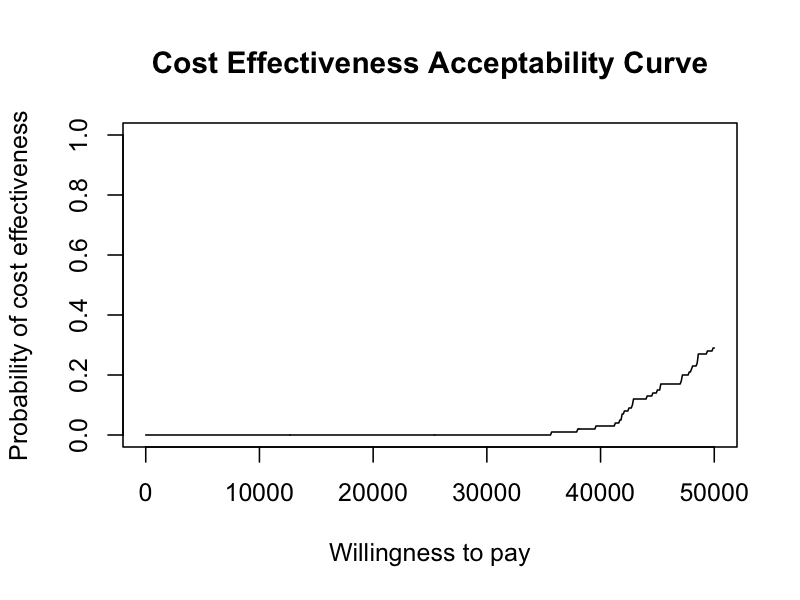
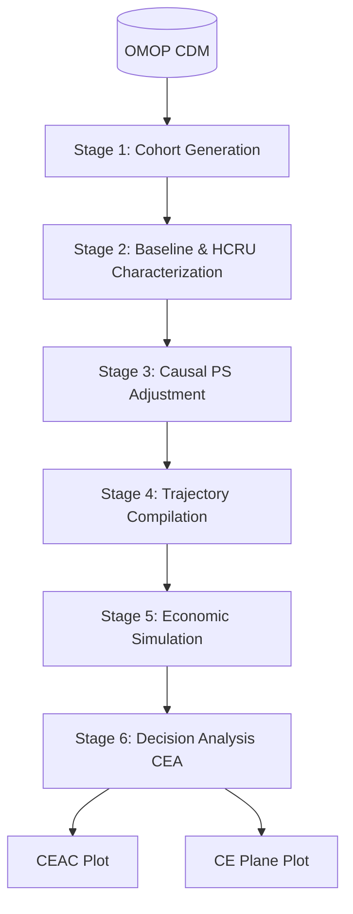

# HERMES

> Health Economic Resource Modeling & Evaluation System

**HERMES** is an R-based framework designed for Real-World Evidence (RWE) and Health Economics and Outcomes Research (HEOR). It streamlines the end-to-end process of Healthcare Resource Utilization (HCRU) analysis and Cost-Effectiveness Analysis (CEA) starting directly from observational data in the OMOP Common Data Model (CDM).

## Features

- **OMOP CDM Native**: Connects programmatically to OMOP CDM databases using [CDMConnector](https://darwin-eu.github.io/CDMConnector/) and [omopgenerics](https://darwin-eu.github.io/omopgenerics/).
- **End-to-End Pipeline**: From cohort generation to economic simulation and decision analysis plots.
- **Causal Inference**: Controls for baseline confounding using Propensity Scores (PS) with high-dimensional regularized logistic regression via [Cyclops](https://ohdsi.github.io/Cyclops/).
- **Standardized Outputs**: Generates decision-analytic plots like CEACs (Cost-Effectiveness Acceptability Curves) powered by [BCEA](https://giabaio.github.io/BCEA/) to inform Health Technology Assessments (HTA).

## Quick Start

> [!NOTE]
> The following example uses DuckDB and the synthetic `Eunomia` dataset to demonstrate the complete 6-stage pipeline.

```R
library(HERMES)
library(CDMConnector)
library(CohortConstructor)

# 0. Setup Connection (DuckDB Eunomia)
Sys.setenv(EUNOMIA_DATA_FOLDER = file.path(tempdir(), "eunomia"))
con <- DBI::dbConnect(duckdb::duckdb(), CDMConnector::eunomiaDir("GiBleed"))
cdm <- CDMConnector::cdmFromCon(con, cdmSchema = "main", writeSchema = "main")

# Create cohorts (Target, Comparator, Outcome)
cdm$target_cohort <- conceptCohort(cdm, list(target_cohort = 4285898L), "target_cohort")
cdm$comparator_cohort <- conceptCohort(cdm, list(comparator_cohort = 4266809L), "comparator_cohort")
cdm$outcome_cohort <- conceptCohort(cdm, list(outcome_cohort = 192671L), "outcome_cohort")

# 1-6. Run the End-to-End Pipeline
study <- init(cdm, "target_cohort", "comparator_cohort", "outcome_cohort") |>
  summarise_baseline() |>
  extract_hcru() |>
  fit_ps() |>
  adjust_ps() |>
  compile_trajectories() |>
  simulate_economics() |>
  run_cea()

# Generate plots
plot_ceac(study)
plot_plane(study)
```

### Outputs

<p align="center">
  
  
</p>

---

<details>
<summary><b>The 6-Stage Architecture</b></summary>
<br>

HERMES relies on a strict 6-stage analytical framework to transition from observational data to actionable insights.



1. **Cohort Generation**: Define target treatment, comparator, and clinical outcome cohorts using standardized vocabularies.
2. **Descriptive Baseline & HCRU Characterization**: Build unadjusted baseline tables, enrich with demographics (using [PatientProfiles](https://darwin-eu.github.io/PatientProfiles/)), and extract raw medical costs and care utilization.
3. **Causal Propensity Score (PS) Adjustment**: Fit high-dimensional regularized logistic regression models based on baseline clinical features to estimate propensity scores and match populations.
4. **Trajectory Compilation & State-Cost Extraction**: Compile balanced patient timelines into mutually exclusive health states over discrete time cycles, extracting state-specific expenditure distributions.
5. **Economic Simulation**: Integrate probabilities and cost distributions into an economic state-transition model. Project long-term costs and Quality-Adjusted Life-Years (QALYs).
6. **Decision Analysis & Post-Processing (CEA)**: Compute the Incremental Cost-Effectiveness Ratio (ICER) and Net Monetary Benefit (NMB), generating CEAC and cost-effectiveness plane plots.

</details>

<details>
<summary><b>Documentation</b></summary>
<br>

For a detailed technical overview, function signatures, S3 class object flow, and OMOP `COST` query strategies, please refer to the documentation:

- [API & Architecture Specification](docs/API_SPECIFICATION.md)
- [Agent Guidelines & Architecture Instructions](AGENTS.md)

</details>