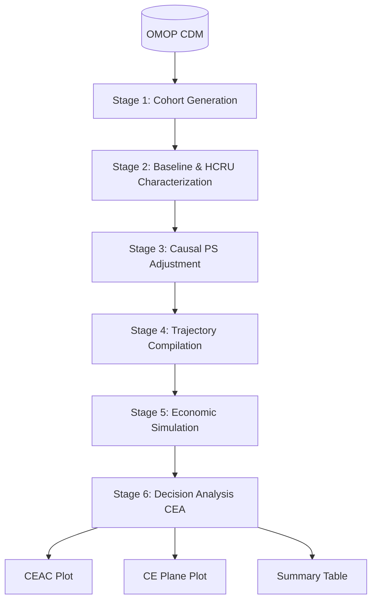

# HERMES

> Health Economic Resource Modeling & Evaluation System

**HERMES** is an R-based analytical ecosystem designed for Real-World Evidence (RWE) and Health Economics and Outcomes Research (HEOR). It streamlines the end-to-end process of Healthcare Resource Utilization (HCRU) analysis, direct medical costing, and Cost-Effectiveness Analysis (CEA) directly from observational healthcare data in the OMOP Common Data Model (CDM).

---

## The Modular Package Suite

HERMES is structured as a **modular monorepo** containing three specialized domain packages conforming to the DARWIN EU standard, unified by the root `hermes` umbrella metapackage:

| Package | Directory | Primary Scope & Key Verbs |
| :--- | :--- | :--- |
| **`CohortUtilisation`** | `packages/CohortUtilisation` | In-database HCRU extraction (`addInpatients`, `addEmergencyCare`, `addOutpatientVisits`, `addVisits`, `addPrescriptions`, `addProcedures`, `computeHospitalizationCohorts`, `computeInfusionCohorts`, `summariseUtilization`, `tableUtilization`, `plotUtilization`). |
| **`CohortCosts`** | `packages/CohortCosts` | Direct medical expenditures and OMOP `COST` linkage (`addCosts`, `summariseCosts`, `tableCosts`, `plotCosts`). |
| **`CohortEconomics`** | `packages/CohortEconomics` | Causal propensity scores, Markov state trajectories, microsimulations, and CEA (`init`, `summarise_baseline`, `extract_hcru`, `fit_ps`, `adjust_ps`, `compile_trajectories`, `simulate_economics`, `run_cea`). |
| **`hermes`** | Root | Umbrella metapackage providing a unified entry point, startup banner, and full re-exports. |

---

## Installation

```R
# Install the complete hermes ecosystem (recommended)
pak::pkg_install("iomedhealth/hermes")

# Or install individual standalone domain packages
pak::pkg_install("iomedhealth/hermes/packages/CohortUtilisation")
pak::pkg_install("iomedhealth/hermes/packages/CohortCosts")
pak::pkg_install("iomedhealth/hermes/packages/CohortEconomics")
```

---

## Quick Starts

### Workflow 1: In-Database Cohort Utilization & Cost Enrichment

Enrich study cohorts in-database across configurable temporal windows (e.g. baseline `[-365, -1]`, 1-year follow-up `[0, 365]`, or full follow-up `[0, Inf]`) and generate publication-ready tables:

```R
library(hermes)
library(dplyr)

# 0. Connect to CDM (built-in synthetic mock database)
cdm <- mockHERMES()

# 1. Enrich cohort with visits, prescriptions, and direct costs in-database
cdm$study_enriched <- cdm$target_cohort |>
  addVisits(
    window = list(baseline = c(-365, -1), followup = c(0, 365)),
    settings = c("inpatient", "outpatient", "emergency"),
    stratifySpecialty = TRUE,
    readmissions = TRUE
  ) |>
  addPrescriptions(
    window = list(followup = c(0, 365)),
    daysSupply = TRUE,
    pdc = TRUE
  ) |>
  addCosts(
    window = list(followup = c(0, 365)),
    costField = "total_paid",
    name = "study_enriched"
  )

# 2. Summarise utilization and costs into standardised results
util_summary <- summariseUtilization(cdm$study_enriched)
cost_summary <- summariseCosts(cdm$study_enriched)

# 3. Format publication tables (GT, Flextable, or Tibble)
tableUtilization(util_summary)
tableCosts(cost_summary)
```

---

### Workflow 2: 6-Stage HEOR Causal & Decision-Analytic Simulation Pipeline

Run the complete causal inference and economic simulation pipeline to compare a Target treatment arm against a Standard of Care Comparator:

```R
library(hermes)

# 0. Setup Connection
cdm <- mockHERMES()

# 1-6. Run the End-to-End Pipeline
study <- init(
  cdm = cdm,
  target_cohort = "target_cohort",
  comparator_cohort = "comparator_cohort",
  outcome_cohort = "outcome_cohort"
) |>
  summarise_baseline() |>
  extract_hcru() |>
  fit_ps() |>
  adjust_ps() |>
  compile_trajectories() |>
  simulate_economics(time_horizon = 10, n_samples = 100) |>
  run_cea()

# Decision-Analytic Visualizations & Summary
plot_ceac(study)
plot_plane(study)
table_summary(study)
```

### Outputs

<p align="center">
  
  
</p>

---

<details>
<summary><b>The 6-Stage HEOR Architecture</b></summary>
<br>

HERMES relies on a strict 6-stage analytical framework to transition from observational data to actionable health technology assessment insights:



1. **Cohort Generation (`init`)**: Define target treatment, comparator, and clinical outcome cohorts.
2. **Descriptive Baseline & HCRU Characterization (`summarise_baseline`, `extract_hcru`)**: Build unadjusted baseline tables, enrich with demographics (via [PatientProfiles](https://darwin-eu.github.io/PatientProfiles/)), and extract unadjusted care utilization and direct medical costs.
3. **Causal Propensity Score Adjustment (`fit_ps`, `adjust_ps`, `assess_balance`)**: Fit regularized logistic regression models (via [Cyclops](https://ohdsi.github.io/Cyclops/)) based on baseline clinical features to estimate propensity scores and perform matching.
4. **Trajectory Compilation & State-Cost Extraction (`compile_trajectories`)**: Slices patient timelines into discrete health states over uniform time cycles, extracting state-to-state transition probabilities and state-specific expenditure distributions.
5. **Economic Simulation (`simulate_economics`)**: Runs a Markov state-transition microsimulation incorporating parametric uncertainty (PSA) to project lifetime costs and QALYs.
6. **Decision Analysis & Post-Processing (`run_cea`)**: Computes the Incremental Cost-Effectiveness Ratio (ICER) and Net Monetary Benefit (NMB), generating CEAC and cost-effectiveness plane plots powered by [BCEA](https://giabaio.github.io/BCEA/).

</details>

---

## Documentation & Vignettes

* **[The HERMES Ecosystem & Modular Suite](vignettes/hermes-ecosystem.Rmd)**: Architecture, package separation, and workflow guide.
* **[Introduction to HEOR for OMOP Users](vignettes/intro-to-heor.Rmd)**: Conceptual Rosetta Stone translating OHDSI concepts to Health Economics.
* **[Cohort Utilization & Cost Enrichment](vignettes/cohort-utilization.Rmd)**: Step-by-step hands-on guide for `CohortUtilisation` and `CohortCosts` verbs.
* **[HCRU Extraction Logic](vignettes/hcru_logic.Rmd)**: Deep dive into the OMOP `COST` table extraction and fallback rules.
