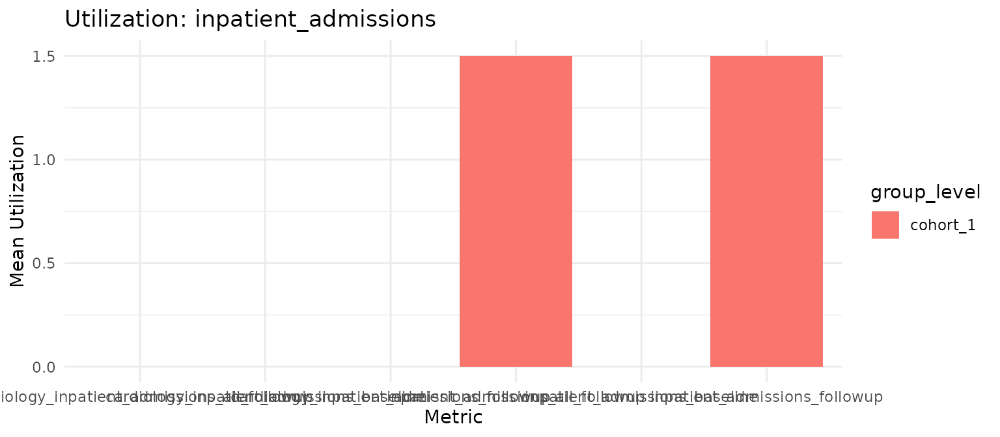
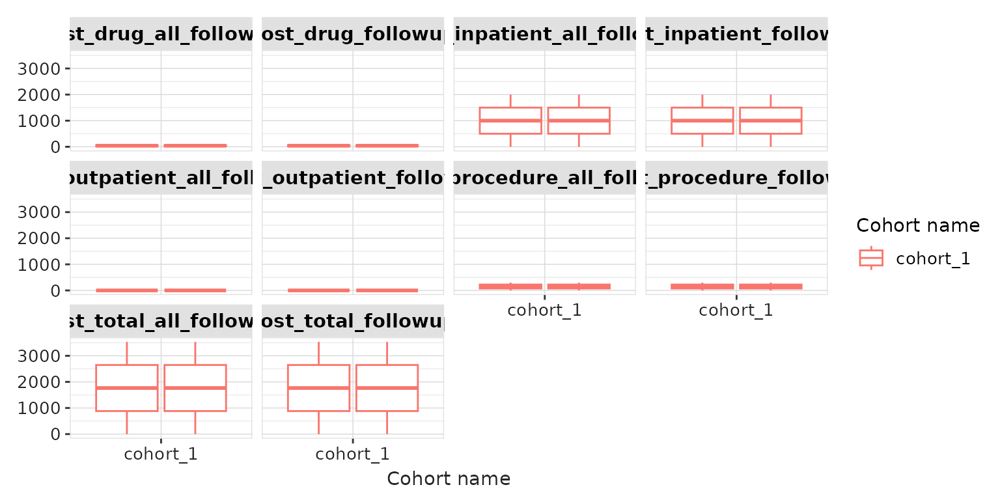

# Cohort Utilization & Cost Enrichment

## Cohort Utilization & Cost Enrichment

In Health Economics and Outcomes Research (HEOR) and Real-World Evidence
(RWE), evaluating Healthcare Resource Utilization (HCRU) and direct
medical costs requires capturing granular patient encounters across
multiple care settings (inpatient, outpatient, emergency, pharmacy,
diagnostics, procedures, and financial claims).

Following the **DARWIN EU / OHDSI** package ecosystem standards
(`CohortConstructor`, `PatientProfiles`, `CohortCharacteristics`),
**HERMES** provides a pipe-friendly, 3-layer architecture for cohort
construction, in-database column enrichment, and standardized reporting.

------------------------------------------------------------------------

### 3-Layer Architecture Overview

``` text
┌────────────────────────────────────────────────────────────────────────────────────────┐
│                                   OMOP CDM DATABASE                                    │
│  (visit_occurrence, provider, drug_exposure, procedure_occurrence, measurement, cost)  │
└────────────────────────────────────────────────────────────────────────────────────────┘
                                    │
       ┌────────────────────────────┼────────────────────────────┐
       ▼                            ▼                            ▼
 1. Episode Constructors     2. Cohort Enrichers          3. Summarisation & Reporting
 (CohortConstructor Style)   (PatientProfiles Style)      (CohortCharacteristics Style)
 ─────────────────────────   ───────────────────────      ────────────────────────────
 Standalone episode cohorts  Appends windowed metric      Standardised result objects
 in write schema:            columns in-database:         for publication tables:
 • computeHospitalization*   • addInpatients()            • summariseUtilization()
 • computeInfusionCohorts()  • addEmergencyCare()         • summariseCosts()
                             • addOutpatientVisits()      • tableUtilization()
                             • addPrescriptions()         • tableCosts()
                             • addProcedures()            • plotUtilization()
                             • addCosts()                 • plotCosts()
                             • addVisits() (composite)
```

------------------------------------------------------------------------

### 1. Setup & CDM Connection

We initialize an OMOP CDM reference (such as the mock HERMES test
database):

``` r

library(HERMES)
library(dplyr)
library(omopgenerics)

# Connect to OMOP CDM
cdm <- mockHERMES()
```

------------------------------------------------------------------------

### 2. Layer 1: Care Episode Cohort Constructors (`CohortConstructor` Style)

Care episode constructors collapse contiguous or overlapping raw
encounters into discrete hospitalization or infusion therapy episodes
and register them in the database write schema.

#### Hospitalization & Readmission Episodes

``` r

# Construct collapsed hospitalization episodes and 30-day readmissions
cdm$hosp_episodes <- computeHospitalizationCohorts(
  cdm = cdm,
  name = "hosp_episodes",
  visitConceptIds = c(9201L, 8717L, 581379L),
  icuConceptIds = 32037L,
  readmissionWindow = 30L
)

# Inspect cohort entries
cdm$hosp_episodes |>
  dplyr::collect()
#> # A tibble: 4 × 4
#>   cohort_definition_id subject_id cohort_start_date cohort_end_date
#>                  <int>      <int> <date>            <date>         
#> 1                    1          1 2010-02-01        2010-02-05     
#> 2                    1          2 2010-03-10        2010-03-15     
#> 3                    1          1 2010-02-20        2010-02-23     
#> 4                    2          1 2010-02-20        2010-02-23
```

#### Infusion Administration Episodes

``` r

# Construct parenteral/intravenous infusion therapy episodes
cdm$infusion_episodes <- computeInfusionCohorts(
  cdm = cdm,
  name = "infusion_episodes",
  routeConceptIds = c(4171047L) # Intravenous
)

cdm$infusion_episodes |>
  dplyr::collect()
#> # A tibble: 1 × 4
#>   cohort_definition_id subject_id cohort_start_date cohort_end_date
#>                  <int>      <int> <date>            <date>         
#> 1                    1          1 2010-03-01        2010-03-01
```

------------------------------------------------------------------------

### 3. Layer 2: In-Database Cohort Enrichment (`PatientProfiles` Style)

Cohort enricher functions take an existing study cohort, execute
database-side joins across configurable temporal windows (e.g., baseline
`[-365, -1]`, 1-year follow-up `[0, 365]`, or full follow-up
`[0, Inf]`), and append metric columns without dropping zero-utilization
subjects.

#### Modular Enricher Pipeline

``` r

# Pipe study cohort through all domain enrichers with fixed and open-ended windows
cdm$study_enriched <- cdm$target_cohort |>
  addInpatients(
    window = list(baseline = c(-365, -1), followup = c(0, 365), all_followup = c(0, Inf)),
    readmissions = TRUE,
    stratifySpecialty = TRUE,
    specialties = list(cardiology = 38004453L)
  ) |>
  addEmergencyCare(
    window = list(baseline = c(-365, -1), followup = c(0, 365), all_followup = c(0, Inf))
  ) |>
  addOutpatientVisits(
    window = list(baseline = c(-365, -1), followup = c(0, 365), all_followup = c(0, Inf)),
    stratifySpecialty = TRUE,
    includeEmergency = FALSE
  ) |>
  addPrescriptions(
    window = list(baseline = c(-365, -1), followup = c(0, 365), all_followup = c(0, Inf)),
    daysSupply = TRUE,
    pdc = TRUE
  ) |>
  addProcedures(
    window = list(baseline = c(-365, -1), followup = c(0, 365), all_followup = c(0, Inf))
  ) |>
  addCosts(
    window = list(baseline = c(-365, -1), followup = c(0, 365), all_followup = c(0, Inf)),
    costField = "total_paid",
    name = "study_enriched"
  )

# Inspect enriched columns
colnames(cdm$study_enriched)
#>  [1] "cohort_definition_id"                        
#>  [2] "subject_id"                                  
#>  [3] "cohort_start_date"                           
#>  [4] "cohort_end_date"                             
#>  [5] "inpatient_admissions_baseline"               
#>  [6] "inpatient_los_days_baseline"                 
#>  [7] "icu_admissions_baseline"                     
#>  [8] "icu_los_days_baseline"                       
#>  [9] "readmissions_30d_baseline"                   
#> [10] "readmissions_90d_baseline"                   
#> [11] "cardiology_inpatient_admissions_baseline"    
#> [12] "inpatient_admissions_followup"               
#> [13] "inpatient_los_days_followup"                 
#> [14] "icu_admissions_followup"                     
#> [15] "icu_los_days_followup"                       
#> [16] "readmissions_30d_followup"                   
#> [17] "readmissions_90d_followup"                   
#> [18] "cardiology_inpatient_admissions_followup"    
#> [19] "inpatient_admissions_all_followup"           
#> [20] "inpatient_los_days_all_followup"             
#> [21] "icu_admissions_all_followup"                 
#> [22] "icu_los_days_all_followup"                   
#> [23] "readmissions_30d_all_followup"               
#> [24] "readmissions_90d_all_followup"               
#> [25] "cardiology_inpatient_admissions_all_followup"
#> [26] "emergency_visits_baseline"                   
#> [27] "emergency_visits_followup"                   
#> [28] "emergency_visits_all_followup"               
#> [29] "gp_visits_baseline"                          
#> [30] "specialist_visits_baseline"                  
#> [31] "other_outpatient_visits_baseline"            
#> [32] "gp_visits_followup"                          
#> [33] "specialist_visits_followup"                  
#> [34] "other_outpatient_visits_followup"            
#> [35] "gp_visits_all_followup"                      
#> [36] "specialist_visits_all_followup"              
#> [37] "other_outpatient_visits_all_followup"        
#> [38] "rx_fills_baseline"                           
#> [39] "days_supply_baseline"                        
#> [40] "infusions_baseline"                          
#> [41] "pdc_baseline"                                
#> [42] "rx_fills_followup"                           
#> [43] "days_supply_followup"                        
#> [44] "infusions_followup"                          
#> [45] "pdc_followup"                                
#> [46] "rx_fills_all_followup"                       
#> [47] "days_supply_all_followup"                    
#> [48] "infusions_all_followup"                      
#> [49] "pdc_all_followup"                            
#> [50] "lab_tests_count_baseline"                    
#> [51] "procedures_count_baseline"                   
#> [52] "lab_tests_count_followup"                    
#> [53] "procedures_count_followup"                   
#> [54] "lab_tests_count_all_followup"                
#> [55] "procedures_count_all_followup"               
#> [56] "cost_inpatient_baseline"                     
#> [57] "cost_outpatient_baseline"                    
#> [58] "cost_drug_baseline"                          
#> [59] "cost_procedure_baseline"                     
#> [60] "cost_total_baseline"                         
#> [61] "cost_inpatient_followup"                     
#> [62] "cost_outpatient_followup"                    
#> [63] "cost_drug_followup"                          
#> [64] "cost_procedure_followup"                     
#> [65] "cost_total_followup"                         
#> [66] "cost_inpatient_all_followup"                 
#> [67] "cost_outpatient_all_followup"                
#> [68] "cost_drug_all_followup"                      
#> [69] "cost_procedure_all_followup"                 
#> [70] "cost_total_all_followup"
```

#### All-In-One Multi-Setting Visits with `addVisits()`

To extract Inpatient, Outpatient, and Emergency utilization in a single
step with unified specialty stratification:

``` r

cdm$visits_enriched <- cdm$target_cohort |>
  addVisits(
    window = list(baseline = c(-365, -1), all_followup = c(0, Inf)),
    settings = c("inpatient", "outpatient", "emergency"),
    stratifySpecialty = TRUE,
    specialties = list(
      oncology = c(38004507L, 38004006L),
      cardiology = 38004453L
    ),
    readmissions = TRUE,
    name = "visits_enriched"
  )

colnames(cdm$visits_enriched)
#>  [1] "cohort_definition_id"                        
#>  [2] "subject_id"                                  
#>  [3] "cohort_start_date"                           
#>  [4] "cohort_end_date"                             
#>  [5] "inpatient_admissions_baseline"               
#>  [6] "inpatient_los_days_baseline"                 
#>  [7] "icu_admissions_baseline"                     
#>  [8] "icu_los_days_baseline"                       
#>  [9] "readmissions_30d_baseline"                   
#> [10] "readmissions_90d_baseline"                   
#> [11] "oncology_inpatient_admissions_baseline"      
#> [12] "cardiology_inpatient_admissions_baseline"    
#> [13] "inpatient_admissions_all_followup"           
#> [14] "inpatient_los_days_all_followup"             
#> [15] "icu_admissions_all_followup"                 
#> [16] "icu_los_days_all_followup"                   
#> [17] "readmissions_30d_all_followup"               
#> [18] "readmissions_90d_all_followup"               
#> [19] "oncology_inpatient_admissions_all_followup"  
#> [20] "cardiology_inpatient_admissions_all_followup"
#> [21] "gp_visits_baseline"                          
#> [22] "specialist_visits_baseline"                  
#> [23] "other_outpatient_visits_baseline"            
#> [24] "oncology_visits_baseline"                    
#> [25] "cardiology_visits_baseline"                  
#> [26] "gp_visits_all_followup"                      
#> [27] "specialist_visits_all_followup"              
#> [28] "other_outpatient_visits_all_followup"        
#> [29] "oncology_visits_all_followup"                
#> [30] "cardiology_visits_all_followup"              
#> [31] "emergency_visits_baseline"                   
#> [32] "oncology_emergency_visits_baseline"          
#> [33] "cardiology_emergency_visits_baseline"        
#> [34] "emergency_visits_all_followup"               
#> [35] "oncology_emergency_visits_all_followup"      
#> [36] "cardiology_emergency_visits_all_followup"
```

------------------------------------------------------------------------

### 4. Layer 3: Analytics & Reporting (`CohortCharacteristics` Style)

We aggregate patient-level utilization and costs into DARWIN EU
standardized `summarised_result` objects compatible with
`visOmopResults`.

#### Summarise Care Utilization

``` r

utilSummary <- summariseUtilization(
  cohort = cdm$study_enriched,
  strata = list("cohort_definition_id"),
  estimates = c("mean", "sd", "median", "q25", "q75", "min", "max")
)

# View standardised result structure
utilSummary |>
  dplyr::select("strata_name", "strata_level", "variable_name", "estimate_name", "estimate_value") |>
  utils::head(10)
#> # A tibble: 10 × 5
#>    strata_name strata_level variable_name           estimate_name estimate_value
#>    <chr>       <chr>        <chr>                   <chr>         <chr>         
#>  1 overall     overall      number records          count         2             
#>  2 overall     overall      number subjects         count         2             
#>  3 overall     overall      inpatient_admissions_b… mean          0             
#>  4 overall     overall      inpatient_admissions_b… sd            0             
#>  5 overall     overall      inpatient_admissions_b… median        0             
#>  6 overall     overall      inpatient_admissions_b… q25           0             
#>  7 overall     overall      inpatient_admissions_b… q75           0             
#>  8 overall     overall      inpatient_admissions_b… min           0             
#>  9 overall     overall      inpatient_admissions_b… max           0             
#> 10 overall     overall      inpatient_los_days_bas… mean          0
```

#### Summarise Direct Medical Costs

``` r

costSummary <- summariseCosts(
  cohort = cdm$study_enriched,
  strata = list("cohort_definition_id"),
  estimates = c("mean", "sd", "median", "q25", "q75", "min", "max")
)

costSummary |>
  dplyr::select("strata_name", "strata_level", "variable_name", "estimate_name", "estimate_value") |>
  utils::head(8)
#> # A tibble: 8 × 5
#>   strata_name strata_level variable_name           estimate_name estimate_value
#>   <chr>       <chr>        <chr>                   <chr>         <chr>         
#> 1 overall     overall      number records          count         2             
#> 2 overall     overall      number subjects         count         2             
#> 3 overall     overall      cost_inpatient_baseline mean          0             
#> 4 overall     overall      cost_inpatient_baseline sd            0             
#> 5 overall     overall      cost_inpatient_baseline median        0             
#> 6 overall     overall      cost_inpatient_baseline q25           0             
#> 7 overall     overall      cost_inpatient_baseline q75           0             
#> 8 overall     overall      cost_inpatient_baseline min           0
```

#### Publication-Ready GT & Flextable Output

[`tableUtilization()`](../reference/tableUtilization.md) and
[`tableCosts()`](../reference/tableCosts.md) integrate with
[`visOmopResults::visOmopTable()`](https://darwin-eu.github.io/visOmopResults/reference/visOmopTable.html)
to format publication-grade summary tables:

``` r

# Format summary table with concise estimate strings
tableUtilization(
  result = utilSummary,
  estimateName = c(
    "Mean (SD)" = "<mean> (<sd>)",
    "Median [Q25 - Q75]" = "<median> [<q25> - <q75>]"
  ),
  header = c("cohort_name")
)
```

[TABLE]

------------------------------------------------------------------------

### 5. Visualizing Care Utilization & Costs (`visOmopResults` Style)

HERMES provides [`plotUtilization()`](../reference/plotUtilization.md)
and [`plotCosts()`](../reference/plotCosts.md) for rapid exploratory and
publication visualization, leveraging standard `visOmopResults` ggplot
themes and facets.

#### Bar Plots for Care Utilization

``` r

# Bar plot comparing follow-up mean care utilization across key settings
main_util_vars <- c(
  "inpatient_admissions_followup",
  "emergency_visits_followup",
  "gp_visits_followup",
  "specialist_visits_followup",
  "rx_fills_followup"
)

plotUtilization(
  result = utilSummary |> dplyr::filter(variable_name %in% main_util_vars),
  plotType = "barplot",
  x = "cohort_name",
  y = "mean",
  facet = "variable_name",
  colour = "cohort_name"
)
```



#### Box Plots for Direct Medical Costs

``` r

# Box plot showing median and interquartile range for follow-up cost domains
plotCosts(
  result = costSummary |> dplyr::filter(grepl("followup", variable_name)),
  plotType = "boxplot",
  x = "cohort_name",
  facet = "variable_name",
  colour = "cohort_name"
)
```



------------------------------------------------------------------------

### 6. Summary Matrix Mapping

| Domain | Metrics Extracted | Function Responsible | Output Columns |
|:---|:---|:---|:---|
| **\[Inpatient\]** | Admissions, ICU, LOS, Readmissions, Specialties | [`addInpatients()`](../reference/addInpatients.md) ([`addHospitalizations()`](../reference/addInpatients.md)) | `inpatient_admissions_*`, `inpatient_los_days_*`, `icu_admissions_*`, `readmissions_30d_*`, `{specialty}_inpatient_admissions_*` |
| **\[Emergency\]** | ER Visits & Specialist Acute Care | [`addEmergencyCare()`](../reference/addEmergencyCare.md) ([`addEmergency()`](../reference/addEmergencyCare.md)) | `emergency_visits_*`, `{specialty}_emergency_visits_*` |
| **\[Outpatient\]** | GP, Specialist, Other Visits, Specialties | [`addOutpatientVisits()`](../reference/addOutpatientVisits.md) | `gp_visits_*`, `specialist_visits_*`, `other_outpatient_visits_*`, `{specialty}_visits_*` |
| **\[Multi-Setting\]** | Inpatient + Outpatient + Emergency Visits | [`addVisits()`](../reference/addVisits.md) | Combined Inpatient, Outpatient, Emergency columns |
| **\[Pharmacy\]** | Rx Fills, Days Supply, PDC, Infusions | [`addPrescriptions()`](../reference/addPrescriptions.md) | `rx_fills_*`, `days_supply_*`, `pdc_*`, `infusions_*` |
| **\[Diagnostics/Proc\]** | Labs, Imaging, Procedures | [`addProcedures()`](../reference/addProcedures.md) | `lab_tests_count_*`, `procedures_count_*` |
| **\[Direct Costs\]** | Inpatient, Outpatient, Drug, Total | [`addCosts()`](../reference/addCosts.md) | `cost_inpatient_*`, `cost_outpatient_*`, `cost_drug_*`, `cost_total_*` |
