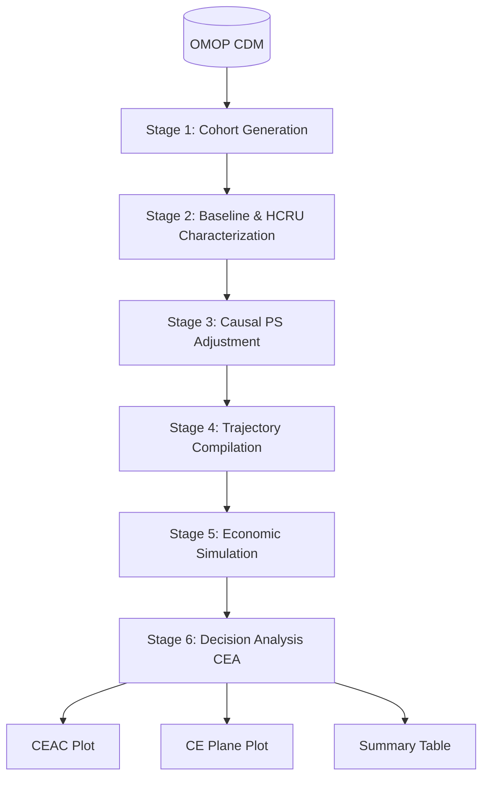

# HERMES: Health Economic Resource Modeling & Evaluation System

[](https://github.com/iomedhealth/hermes/actions/workflows/R-CMD-check.yaml)
[](https://iomedhealth.github.io/hermes/)
[](https://github.com/iomedhealth/hermes/releases)
[](https://opensource.org/licenses/MIT)

**HERMES** is an R-based analytical ecosystem developed by
[IOMED](https://iomed.health) for Real-World Evidence (RWE) and Health
Economics and Outcomes Research (HEOR). It streamlines the end-to-end
process of Healthcare Resource Utilization (HCRU) analysis, direct
medical costing, and Cost-Effectiveness Analysis (CEA) directly on
observational healthcare data structured in the **OMOP Common Data Model
(CDM)**.

------------------------------------------------------------------------

## Technology Stack

| Layer | Technologies & Dependencies | Description |
|:---|:---|:---|
| **Language & Core** | `R (>= 4.1.0)`, `rlang`, `cli`, `glue` | Base R execution engine and tidy evaluation framework. |
| **OMOP / DARWIN EU** | `omopgenerics (>= 0.3.0)`, `CDMConnector (>= 1.4.0)`, `PatientProfiles`, `CohortConstructor`, `CohortCharacteristics`, `visOmopResults` | Database-agnostic cohort manipulation, patient profiling, and standardized result schemas. |
| **Database & SQL Engine** | `duckdb`, `dbplyr (>= 2.4.0)`, `DBI`, `dplyr (>= 1.1.0)` | High-performance in-database SQL translation and in-memory analytical querying. |
| **Causal & HEOR Engines** | `Cyclops`, `CohortMethod`, `hesim`, `BCEA`, `stats` | High-dimensional regularized logistic regression, Markov microsimulations, and Bayesian CEA. |
| **Reporting & Formatting** | `ggplot2`, `gt`, `flextable`, `tibble` | Publication-ready summary tables, cost-effectiveness acceptability curves, and planes. |
| **Tooling & Maintenance** | `testthat (>= 3.0.0)`, `pkgdown`, `knitr`, `rmarkdown`, `styler`, `lintr` | Monorepo package checking, continuous integration, and automated documentation. |

------------------------------------------------------------------------

## Project Architecture

HERMES is structured as a **modular monorepo** consisting of three
specialized domain packages conforming to DARWIN EU standards, unified
under the root `hermes` umbrella metapackage:

``` text
┌────────────────────────────────────────────────────────────────────────────────────────┐
│                                   OMOP CDM DATABASE                                    │
│  (visit_occurrence, provider, drug_exposure, procedure_occurrence, measurement, cost)  │
└────────────────────────────────────────────────────────────────────────────────────────┘
                                            │
                                            ▼
                    ┌───────────────────────────────────────────────┐
                    │               hermes Metapackage              │
                    │      (Unified entry point & re-exports)       │
                    └───────────────────────┬───────────────────────┘
                                            │
        ┌───────────────────────────────────┼───────────────────────────────────┐
        ▼                                   ▼                                   ▼
┌───────────────────────────┐   ┌───────────────────────────┐   ┌───────────────────────────┐
│     CohortUtilisation     │   │        CohortCosts        │   │      CohortEconomics      │
│  ───────────────────────  │   │  ───────────────────────  │   │  ───────────────────────  │
│  • Inpatient / ICU stays  │   │  • OMOP COST linkage      │   │  • Propensity Scores (PS) │
│  • Emergency care         │   │  • Domain expenditures    │   │  • State trajectories     │
│  • Outpatient visits      │   │  • Standardised summaries │   │  • Markov simulations     │
│  • Prescription adherence │   │  • Cost tables & plots    │   │  • CEA (ICER, CEAC, NMB)  │
│  • Diagnostic procedures  │   │                           │   │                           │
│  • Episode constructors   │   │                           │   │                           │
└───────────────────────────┘   └───────────────────────────┘   └───────────────────────────┘
```

### The 6-Stage Analytical Pipeline



1.  **Stage 1: Cohort Generation (`init`)**: Define target treatment,
    comparator, and clinical outcome cohorts.
2.  **Stage 2: Descriptive Baseline & HCRU Characterization
    (`summarise_baseline`, `extract_hcru`)**: Build unadjusted baseline
    tables, enrich with demographics (via `PatientProfiles`), and
    extract care utilization and direct medical costs.
3.  **Stage 3: Causal Propensity Score Adjustment (`fit_ps`,
    `adjust_ps`, `assess_balance`)**: Fit regularized logistic
    regression (via `Cyclops`) based on baseline clinical features to
    estimate propensity scores and balance cohorts.
4.  **Stage 4: Trajectory Compilation & State-Cost Extraction
    (`compile_trajectories`)**: Slice longitudinal patient timelines
    into discrete health states, extracting transition probability
    matrices and state-specific expenditure distributions.
5.  **Stage 5: Economic Simulation (`simulate_economics`)**: Run a
    Markov state-transition microsimulation with Probabilistic
    Sensitivity Analysis (PSA) to project lifetime costs and QALYs.
6.  **Stage 6: Decision Analysis & Post-Processing (`run_cea`)**:
    Compute Incremental Cost-Effectiveness Ratios (ICER) and Net
    Monetary Benefit (NMB), generating CEAC and cost-effectiveness plane
    plots powered by `BCEA`.

------------------------------------------------------------------------

## Key Features

- **OMOP CDM Native**: Connects directly to OMOP CDM databases via
  `CDMConnector` and `omopgenerics`.
- **3-Layer Care Utilization Suite (`CohortUtilisation`)**:
  - *Layer 1 (Episodes)*:
    [`computeHospitalizationCohorts()`](https://rdrr.io/pkg/CohortUtilisation/man/compute_hospitalization_cohorts.html),
    [`computeInfusionCohorts()`](https://rdrr.io/pkg/CohortUtilisation/man/computeInfusionCohorts.html).
  - *Layer 2 (Enrichers)*:
    [`addInpatients()`](https://rdrr.io/pkg/CohortUtilisation/man/addInpatients.html),
    [`addEmergencyCare()`](https://rdrr.io/pkg/CohortUtilisation/man/addEmergencyCare.html),
    [`addOutpatientVisits()`](https://rdrr.io/pkg/CohortUtilisation/man/addOutpatientVisits.html),
    [`addVisits()`](https://rdrr.io/pkg/CohortUtilisation/man/addVisits.html),
    [`addPrescriptions()`](https://rdrr.io/pkg/CohortUtilisation/man/addPrescriptions.html),
    [`addProcedures()`](https://rdrr.io/pkg/CohortUtilisation/man/addProcedures.html).
  - *Layer 3 (Reporting)*:
    [`summariseUtilization()`](https://rdrr.io/pkg/CohortUtilisation/man/summariseUtilization.html),
    [`tableUtilization()`](https://rdrr.io/pkg/CohortUtilisation/man/tableUtilization.html),
    [`plotUtilization()`](https://rdrr.io/pkg/CohortUtilisation/man/plotUtilization.html).
- **Direct Medical Cost Extraction (`CohortCosts`)**:
  - [`addCosts()`](https://rdrr.io/pkg/CohortCosts/man/addCosts.html),
    [`summariseCosts()`](https://rdrr.io/pkg/CohortCosts/man/summariseCosts.html),
    [`tableCosts()`](https://rdrr.io/pkg/CohortCosts/man/tableCosts.html),
    [`plotCosts()`](https://rdrr.io/pkg/CohortCosts/man/plotCosts.html)
    linking polymorphic OMOP `COST` records.
- **Decision Science & Simulation (`CohortEconomics`)**:
  - End-to-end HEOR simulation from propensity score matching to Markov
    modeling and CEAC visualizations.
- **Instant Prototyping**: Includes
  [`mockHERMES()`](https://iomedhealth.github.io/hermes/reference/mockHERMES.md)
  providing an in-memory synthetic DuckDB OMOP CDM database.

------------------------------------------------------------------------

## Getting Started

### Prerequisites

- R (\>= 4.1.0)
- `pak` package manager (`install.packages("pak")`)

### Installation

``` r

# Install the complete hermes metapackage (recommended)
pak::pkg_install("iomedhealth/hermes")

# Or install individual standalone domain packages
pak::pkg_install("iomedhealth/hermes/packages/CohortUtilisation")
pak::pkg_install("iomedhealth/hermes/packages/CohortCosts")
pak::pkg_install("iomedhealth/hermes/packages/CohortEconomics")
```

------------------------------------------------------------------------

### Quick Start 1: In-Database Cohort Utilization & Cost Enrichment

Enrich study cohorts in-database across configurable temporal windows
(e.g., baseline `[-365, -1]`, follow-up `[0, 365]`, or full follow-up
`[0, Inf]`) and produce publication tables:

``` r

library(hermes)
library(dplyr)

# 0. Connect to CDM (built-in synthetic mock database)
cdm <- mockHERMES()

# 1. Enrich cohort with visits, prescriptions, and direct costs in-database
cdm$study_enriched <- cdm$target_cohort |>
  addVisits(
    window = list(baseline = c(-365, -1), followup = c(0, 365)),
    settings = c("inpatient", "outpatient", "emergency"),
    stratifySpecialty = TRUE,
    readmissions = TRUE
  ) |>
  addPrescriptions(
    window = list(followup = c(0, 365)),
    daysSupply = TRUE,
    pdc = TRUE
  ) |>
  addCosts(
    window = list(followup = c(0, 365)),
    costField = "total_paid",
    name = "study_enriched"
  )

# 2. Summarise utilization and costs into standardised results
util_summary <- summariseUtilization(cdm$study_enriched)
cost_summary <- summariseCosts(cdm$study_enriched)

# 3. Format publication tables (GT, Flextable, or Tibble)
tableUtilization(util_summary)
tableCosts(cost_summary)
```

------------------------------------------------------------------------

### Quick Start 2: 6-Stage HEOR Causal & Decision-Analytic Simulation

Run the complete causal inference, Markov state-transition modeling, and
economic simulation pipeline:

``` r

library(hermes)

# 0. Setup Connection
cdm <- mockHERMES()

# 1-6. Run the End-to-End Pipeline
study <- init(
  cdm = cdm,
  target_cohort = "target_cohort",
  comparator_cohort = "comparator_cohort",
  outcome_cohort = "outcome_cohort"
) |>
  summarise_baseline() |>
  extract_hcru() |>
  fit_ps() |>
  adjust_ps() |>
  compile_trajectories() |>
  simulate_economics(time_horizon = 10, n_samples = 100) |>
  run_cea()

# Decision-Analytic Visualizations & Summary
plot_ceac(study)
plot_plane(study)
table_summary(study)
```

### Outputs


------------------------------------------------------------------------

## Project Structure

``` text
HERMES/
├── DESCRIPTION                         # Metapackage metadata & dependencies
├── NAMESPACE                           # Export directives and package imports
├── README.md                           # Project documentation & quickstarts
├── NEWS.md                             # Changelog & release notes
├── _pkgdown.yml                        # Documentation website configuration
├── AGENTS.md                           # Architecture guidelines & CI conformance rules
│
├── R/                                  # Metapackage source code
│   ├── zzz.R                           # .onAttach() tidyverse-style startup banner
│   ├── mockHERMES.R                    # Synthetic DuckDB OMOP CDM test database generator
│   └── reexports.R                     # Top-level re-exports from subpackages
│
├── packages/                           # Standalone modular domain packages
│   ├── CohortUtilisation/              # In-database HCRU extraction verbs & care episodes
│   │   ├── DESCRIPTION
│   │   ├── NAMESPACE
│   │   ├── R/
│   │   ├── man/
│   │   └── tests/testthat/
│   │
│   ├── CohortCosts/                    # Direct medical expenditure extraction & costing
│   │   ├── DESCRIPTION
│   │   ├── NAMESPACE
│   │   ├── R/
│   │   ├── man/
│   │   └── tests/testthat/
│   │
│   └── CohortEconomics/                # Causal PS, trajectories, microsimulation & CEA
│       ├── DESCRIPTION
│       ├── NAMESPACE
│       ├── R/
│       ├── man/
│       └── tests/testthat/
│
├── vignettes/                          # Documentation guides & deep dives
│   ├── hermes-ecosystem.Rmd            # Overview of the 3 standalone packages & architecture
│   ├── intro-to-heor.Rmd               # Conceptual Rosetta Stone translating OMOP to HEOR
│   ├── cohort-utilization.Rmd          # Hands-on guide for 3-layer in-database cohort enrichers
│   └── hcru_logic.Rmd                  # Technical rules for OMOP COST extraction and fallback
│
├── tests/testthat/                     # Metapackage integration & end-to-end test suites
│   ├── test-e2e.R                      # Full 6-stage pipeline & multi-domain integration test
│   └── test-metapackage.R              # Re-export and multi-domain workflow tests
│
└── .github/                            # Continuous Integration & community files
    ├── CONTRIBUTING.md                 # Contribution guidelines & styling rules
    └── workflows/
        ├── R-CMD-check.yaml            # Multi-OS CRAN check workflow
        └── pkgdown.yaml                # Automated GitHub Pages documentation deployment
```

------------------------------------------------------------------------

## Development Workflow

### 1. Local Monorepo Resolution

Subpackages must be installed and documented locally before building the
root metapackage:

``` r

pak::pkg_install(c(
  "local::packages/CohortUtilisation",
  "local::packages/CohortCosts",
  "local::packages/CohortEconomics"
))
```

### 2. Documenting & Building

``` r

# Update documentation across root and subpackages
devtools::document("packages/CohortUtilisation")
devtools::document("packages/CohortCosts")
devtools::document("packages/CohortEconomics")
devtools::document(".")

# Build pkgdown documentation site
pkgdown::build_site(preview = FALSE, install = FALSE)
```

### 3. Running Checks

``` r

# Run R CMD check with CRAN conformance flags
rcmdcheck::rcmdcheck(args = c("--no-manual", "--as-cran"), error_on = "warning")
```

------------------------------------------------------------------------

## Coding Standards

- **Language:** R (Target R \>= 4.1).

- **Pipes:** Always use the base R pipe `|>` (never `%>%`).

- **Assignment:** Always use `<-` for assignment (never `=`).

- **Naming Conventions (DARWIN EU Standard):**

  - **Functions & Arguments:** `lowerCamelCase` (e.g.,
    [`addInpatients()`](https://rdrr.io/pkg/CohortUtilisation/man/addInpatients.html),
    `indexDate = "cohort_start_date"`).
  - **Database & Cohort Columns:** `snake_case` (e.g.,
    `cohort_start_date`, `inpatient_admissions`, `total_paid`).
  - **S3 Classes:** `snake_case` prefixed with `hermes_` (e.g.,
    `hermes_study`, `hermes_hcru`, `hermes_cea`).

- **Formatting & Linting:**

  ``` r

  styler::style_dir()
  lintr::lint_package(".", linters = lintr::linters_with_defaults(lintr::object_name_linter(styles = "camelCase")))
  ```

------------------------------------------------------------------------

## Testing

HERMES uses `testthat` (edition 3) for automated testing:

- **Subpackage Test Suites**: Dedicated unit tests under
  `packages/*/tests/testthat/` covering every domain enricher, care
  episode constructor, and costing verb.
- **End-to-End Test Suite**: Integration tests under
  `tests/testthat/test-e2e.R` validating the full 6-stage pipeline and
  multi-domain workflows against DuckDB and Eunomia datasets.

To run tests across the ecosystem:

``` r

# Run root test suite
devtools::test()

# Run subpackage test suites
devtools::test("packages/CohortUtilisation")
devtools::test("packages/CohortCosts")
devtools::test("packages/CohortEconomics")
```

------------------------------------------------------------------------

## Contributing

We welcome contributions! Please follow these steps:

1.  Open an issue beforehand to discuss bug reports or proposed
    enhancements.
2.  Provide a minimal reproducible example
    ([reprex](https://reprex.tidyverse.org/)) when reporting bugs.
3.  Adhere to the DARWIN EU code styling and monorepo guidelines in
    [`.github/CONTRIBUTING.md`](https://iomedhealth.github.io/hermes/CONTRIBUTING.md)
    and [`AGENTS.md`](https://iomedhealth.github.io/hermes/AGENTS.md).
4.  Ensure all unit tests, vignette renders, and `devtools::check()`
    pass with 0 errors and 0 warnings before submitting a pull request.

------------------------------------------------------------------------

## License

This project is licensed under the MIT License - see the
[LICENSE](https://iomedhealth.github.io/hermes/LICENSE) file for
details.

Copyright © 2026 [IOMED Medical Solutions S.L.](https://iomed.health)
