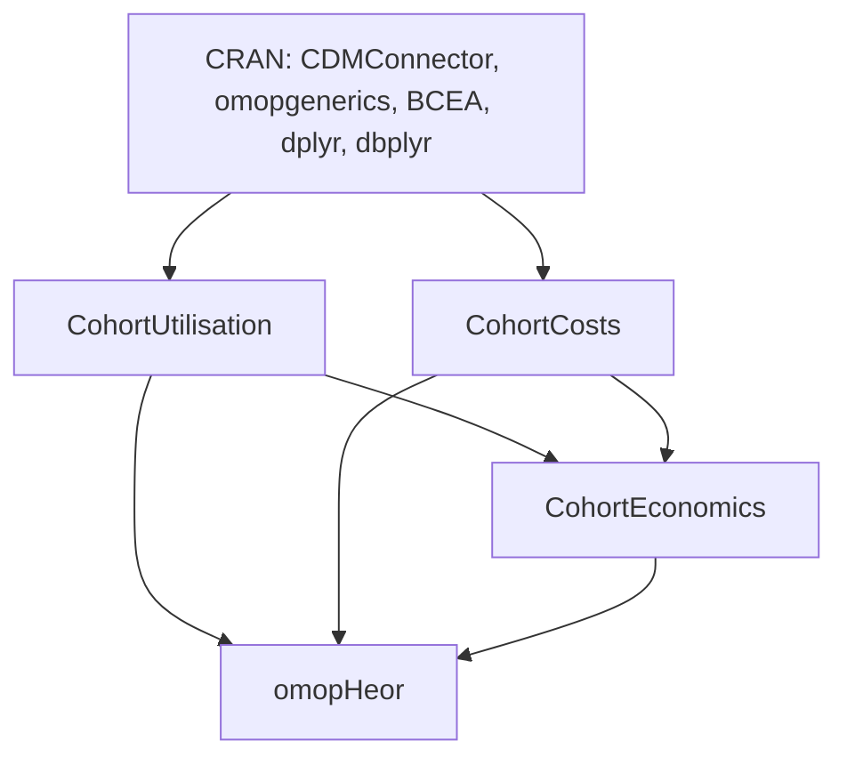

# Data Model & Package Structure: omopHeor Ecosystem

**Feature**: `010-omopheor-cran-cleanup`
**Date**: 2026-08-21

## Monorepo Suite Architecture

The repository maintains 3 focused CRAN domain subpackages and 1 root metapackage:

```text
HERMES (Monorepo)
├── packages/
│   ├── CohortUtilisation/    # Domain 1: HCRU extraction (Inpatient, ED, Outpatient, Rx, Procedures)
│   ├── CohortCosts/          # Domain 2: Direct medical expenditures & OMOP COST table queries
│   └── CohortEconomics/      # Domain 3: Propensity score adjustment, trajectories, microsimulation, CEA
├── DESCRIPTION               # Metapackage (omopHeor)
├── R/                        # Metapackage startup & re-exports
└── vignettes/                # Metapackage integrated vignettes
```

## Package Specification Matrix

| Package Name | Purpose | Upstream Dependencies (CRAN) | S3 Classes / Output | Target Size |
|---|---|---|---|---|
| **`CohortUtilisation`** | HCRU domain metrics extraction | `CDMConnector`, `omopgenerics`, `dbplyr`, `dplyr`, `ggplot2`, `rlang`, `cli`, `glue` | `cohort_table`, `summarised_result` | < 100 KB |
| **`CohortCosts`** | OMOP `COST` tracking and medical expenditure aggregation | `CDMConnector`, `omopgenerics`, `dbplyr`, `dplyr`, `ggplot2`, `rlang`, `cli`, `glue` | `cohort_table`, `summarised_result` | < 100 KB |
| **`CohortEconomics`** | PS adjustment, Markov health states, economic simulation, CEA | `CohortUtilisation`, `CohortCosts`, `BCEA`, `CDMConnector`, `omopgenerics`, `dbplyr`, `dplyr`, `rlang`, `cli`, `glue` | `hermes_study`, `hermes_ps`, `hermes_traj`, `hermes_sim`, `hermes_cea` | < 200 KB |
| **`omopHeor`** | Metapackage umbrella | `CohortUtilisation`, `CohortCosts`, `CohortEconomics`, `CDMConnector`, `omopgenerics`, `dbplyr`, `dplyr`, `rlang`, `cli`, `glue` | Unified attach & re-exports | < 500 KB |

## Dependency Resolution Graph


