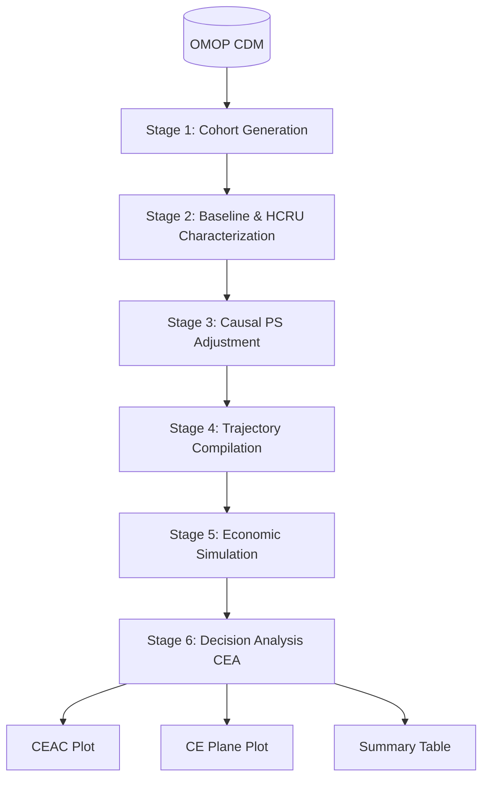

```{r, include = FALSE}
knitr::opts_chunk$set(
  collapse = TRUE,
  comment = "#>",
  eval = TRUE,
  warning = FALSE,
  message = FALSE
)
```

# The HERMES Ecosystem

**HERMES** (Health Economic Resource Modeling & Evaluation System) is an R package ecosystem developed by [IOMED](https://iomed.health) for Real-World Evidence (RWE) and Health Economics and Outcomes Research (HEOR) on observational healthcare data structured in the **OMOP Common Data Model (CDM)**.

Starting in version 0.5.0, HERMES adopts a **modular monorepo architecture** composed of three standalone domain packages under the DARWIN EU standard, unified by the root `hermes` umbrella metapackage.

---

## 1. Why a Modular Suite?

In real-world HEOR workflows, analytical tasks often fall into two distinct paradigms:

1. **Healthcare Resource Utilization & Direct Costing**: Epidemiologists and data scientists need to enrich OMOP cohorts with inpatient admissions, emergency care, outpatient visits, prescriptions, procedures, and claims costs in-database using lightweight dependencies.
2. **Health Economics Modeling & Decision Simulation**: Health economists need causal propensity score matching, longitudinal health-state transitions, Markov microsimulations, and Bayesian Cost-Effectiveness Analysis (CEA) using specialized statistical packages (`Cyclops`, `BCEA`, `CohortMethod`).

Decoupling these domains allows users to install only the dependencies required for their specific workflow while maintaining a single, unified interface through the `hermes` metapackage.

```text
┌────────────────────────────────────────────────────────────────────────────────────────┐
│                                   OMOP CDM DATABASE                                    │
│  (visit_occurrence, provider, drug_exposure, procedure_occurrence, measurement, cost)  │
└────────────────────────────────────────────────────────────────────────────────────────┘
                                            │
                                            ▼
                    ┌───────────────────────────────────────────────┐
                    │               hermes Metapackage              │
                    │      (Unified entry point & re-exports)       │
                    └───────────────────────┬───────────────────────┘
                                            │
        ┌───────────────────────────────────┼───────────────────────────────────┐
        ▼                                   ▼                                   ▼
┌───────────────────────────┐   ┌───────────────────────────┐   ┌───────────────────────────┐
│     CohortUtilisation     │   │        CohortCosts        │   │      CohortEconomics      │
│  ───────────────────────  │   │  ───────────────────────  │   │  ───────────────────────  │
│  • Inpatient / ICU stays  │   │  • OMOP COST linkage      │   │  • Propensity Scores (PS) │
│  • Emergency care         │   │  • Domain expenditures    │   │  • State trajectories     │
│  • Outpatient visits      │   │  • Standardised summaries │   │  • Markov simulations     │
│  • Prescription adherence │   │  • Cost tables & plots    │   │  • CEA (ICER, CEAC, NMB)  │
│  • Diagnostic procedures  │   │                           │   │                           │
│  • Episode constructors   │   │                           │   │                           │
└───────────────────────────┘   └───────────────────────────┘   └───────────────────────────┘
```

---

## 2. Technology Stack

| Layer | Technologies & Dependencies | Description |
| :--- | :--- | :--- |
| **Language & Core** | `R (>= 4.1.0)`, `rlang`, `cli`, `glue` | Base R execution engine and tidy evaluation framework. |
| **OMOP / DARWIN EU** | `omopgenerics (>= 0.3.0)`, `CDMConnector (>= 1.4.0)`, `PatientProfiles`, `CohortConstructor`, `CohortCharacteristics`, `visOmopResults` | Database-agnostic cohort manipulation, patient profiling, and standardized result schemas. |
| **Database & SQL Engine** | `duckdb`, `dbplyr (>= 2.4.0)`, `DBI`, `dplyr (>= 1.1.0)` | High-performance in-database SQL translation and in-memory analytical querying. |
| **Causal & HEOR Engines** | `Cyclops`, `CohortMethod`, `hesim`, `BCEA`, `stats` | High-dimensional regularized logistic regression, Markov microsimulations, and Bayesian CEA. |
| **Reporting & Formatting** | `ggplot2`, `gt`, `flextable`, `tibble` | Publication-ready summary tables, cost-effectiveness acceptability curves, and planes. |
| **Tooling & Maintenance** | `testthat (>= 3.0.0)`, `pkgdown`, `knitr`, `rmarkdown`, `styler`, `lintr` | Monorepo package checking, continuous integration, and automated documentation. |

---

## 3. Package 1: `CohortUtilisation`

**`CohortUtilisation`** is a standalone, lightweight package designed to extract and quantify Healthcare Resource Utilization (HCRU) from OMOP CDM databases without requiring economic modeling dependencies.

It implements a **3-layer architecture** aligned with DARWIN EU standards (`CohortConstructor`, `PatientProfiles`, `CohortCharacteristics`):

* **Layer 1: Care Episode Constructors** (`CohortConstructor` style):
  * `computeHospitalizationCohorts()`: Collapses contiguous/overlapping inpatient stays and derives 30-day readmissions.
  * `computeInfusionCohorts()`: Identifies parenteral and intravenous therapy episodes.
* **Layer 2: In-Database Cohort Enrichers** (`PatientProfiles` style):
  * `addInpatients()` / `addHospitalizations()`: Inpatient admissions, length of stay (LOS), ICU utilization, 30d/90d readmissions, and specialty breakdown.
  * `addEmergencyCare()` / `addEmergency()`: Emergency encounters captured via visit concepts and Emergency Medicine provider specialties.
  * `addOutpatientVisits()`: Primary care (GP), specialist, and other outpatient visits.
  * `addVisits()`: Composite multi-setting enricher covering Inpatient, Outpatient, and Emergency care in one call.
  * `addPrescriptions()`: Medication fills, cumulative days supply, and Proportion of Days Covered (PDC).
  * `addProcedures()`: Diagnostic measurements, laboratory tests, and clinical procedures.
* **Layer 3: Analytics & Reporting** (`CohortCharacteristics` style):
  * `summariseUtilization()`: Aggregates metrics into standardized `summarised_result` objects.
  * `tableUtilization()`: Formats publication-ready tables with `gt`, `flextable`, or `tibble`.
  * `plotUtilization()`: Renders ggplot2 visualizations of utilization distributions.

### Example: Cohort Enrichment

```{r cu_demo}
library(hermes)
library(dplyr)

# Load synthetic mock CDM
cdm <- mockHERMES()

# Enrich cohort across baseline [-365, -1] and 1-year follow-up [0, 365]
cdm$target_enriched <- cdm$target_cohort |>
  addVisits(
    window = list(baseline = c(-365, -1), followup = c(0, 365)),
    settings = c("inpatient", "outpatient", "emergency"),
    stratifySpecialty = TRUE,
    readmissions = TRUE
  ) |>
  addPrescriptions(
    window = list(followup = c(0, 365)),
    daysSupply = TRUE,
    pdc = TRUE,
    name = "target_enriched"
  )

# View enriched columns
colnames(cdm$target_enriched)
```

---

## 4. Package 2: `CohortCosts`

**`CohortCosts`** handles direct medical cost extraction by linking polymorphic OMOP `COST` table records across clinical events (`Condition`, `Visit`, `Drug`, `Procedure`, `Measurement`).

Key capabilities:

* **In-Database Cost Enrichment (`addCosts()`)**:
  * Appends windowed expenditure columns by domain (`cost_inpatient_*`, `cost_outpatient_*`, `cost_drug_*`, `cost_procedure_*`, `cost_total_*`).
  * Gracefully handles missing/empty cost tables with automatic zero-filling.
* **Cost Summarisation & Visualization**:
  * `summariseCosts()`: Aggregates patient expenditures into `summarised_result` tables.
  * `tableCosts()`: Generates publication tables formatted with `gt` or `flextable`.
  * `plotCosts()`: Produces grouped barplots and boxplots of cost distributions.

### Example: Direct Medical Costing

```{r cc_demo}
# Add direct medical costs across follow-up
cdm$target_costed <- cdm$target_enriched |>
  addCosts(
    window = list(followup = c(0, 365)),
    costField = "total_paid",
    name = "target_costed"
  )

# Summarise expenditures
cost_summary <- summariseCosts(cdm$target_costed)

# Render formatted table
tableCosts(cost_summary, type = "tibble")
```

---

## 5. Package 3: `CohortEconomics`

**`CohortEconomics`** is the core Health Economics and Outcomes Research (HEOR) modeling package. It implements the complete **6-stage analytical pipeline** from cohort definition to decision analysis:



1. **Stage 1: Cohort Generation & Initialization** (`init()`): Sets up target treatment, comparator, and clinical outcome cohorts.
2. **Stage 2: Descriptive Baseline & HCRU Extraction** (`summarise_baseline()`, `extract_hcru()`): Computes demographics, baseline characteristics, and care utilization with health-state tagging.
3. **Stage 3: Causal Propensity Score (PS) Adjustment** (`fit_ps()`, `adjust_ps()`, `assess_balance()`): Fits regularized logistic regression via `Cyclops` to perform caliper matching and evaluate covariate balance (SMD).
4. **Stage 4: Trajectory Compilation & State-Cost Extraction** (`compile_trajectories()`): Converts longitudinal patient timelines into Markov health-state transition matrices and state-specific cost distributions.
5. **Stage 5: Economic Simulation** (`simulate_economics()`): Runs probabilistic sensitivity analysis (PSA) simulating lifetime costs and Quality-Adjusted Life-Years (QALYs).
6. **Stage 6: Decision Analysis & Post-Processing** (`run_cea()`, `plot_ceac()`, `plot_plane()`, `table_summary()`): Calculates Incremental Cost-Effectiveness Ratios (ICER) and Net Monetary Benefit (NMB) via `BCEA`.

### Example: End-to-End HEOR Pipeline

```{r ce_demo}
# 1-6. Run the complete pipeline
study <- init(
  cdm = cdm,
  target_cohort = "target_cohort",
  comparator_cohort = "comparator_cohort",
  outcome_cohort = "outcome_cohort"
) |>
  summarise_baseline() |>
  extract_hcru() |>
  fit_ps() |>
  adjust_ps() |>
  compile_trajectories() |>
  simulate_economics(time_horizon = 5, n_samples = 25) |>
  run_cea()

# Decision analytic summary
table_summary(study)
```

---

## 6. The `hermes` Umbrella Metapackage

The root **`hermes`** package unifies `CohortUtilisation`, `CohortCosts`, and `CohortEconomics` into a single, cohesive developer experience:

* **One-Step Installation**: `pak::pkg_install("iomedhealth/hermes")` installs all subpackages and dependencies.
* **Unified Attachment**: `library(hermes)` attaches all three packages and re-exports all analytical functions.
* **Built-in Mock Data**: `mockHERMES()` provides a self-contained in-memory DuckDB OMOP CDM database for testing and demonstrations.

---

## 7. Package Summary Matrix

| Package | Primary Scope | Key Verbs | Target Persona |
| :--- | :--- | :--- | :--- |
| **`CohortUtilisation`** | In-database HCRU extraction across care settings | `addInpatients()`, `addEmergencyCare()`, `addOutpatientVisits()`, `addVisits()`, `addPrescriptions()`, `addProcedures()`, `computeHospitalizationCohorts()`, `summariseUtilization()`, `tableUtilization()` | Epidemiologists, Data Analysts |
| **`CohortCosts`** | Direct medical costs & OMOP COST table linkage | `addCosts()`, `summariseCosts()`, `tableCosts()`, `plotCosts()` | Health Economists, Financial Analysts |
| **`CohortEconomics`** | Propensity scores, trajectories, simulation & CEA | `init()`, `summarise_baseline()`, `extract_hcru()`, `fit_ps()`, `adjust_ps()`, `compile_trajectories()`, `simulate_economics()`, `run_cea()`, `plot_ceac()`, `plot_plane()` | Health Economists, HTA Researchers |
| **`hermes`** | Umbrella metapackage & unified developer interface | All verbs re-exported + `mockHERMES()` | All RWE / HEOR Practitioners |
